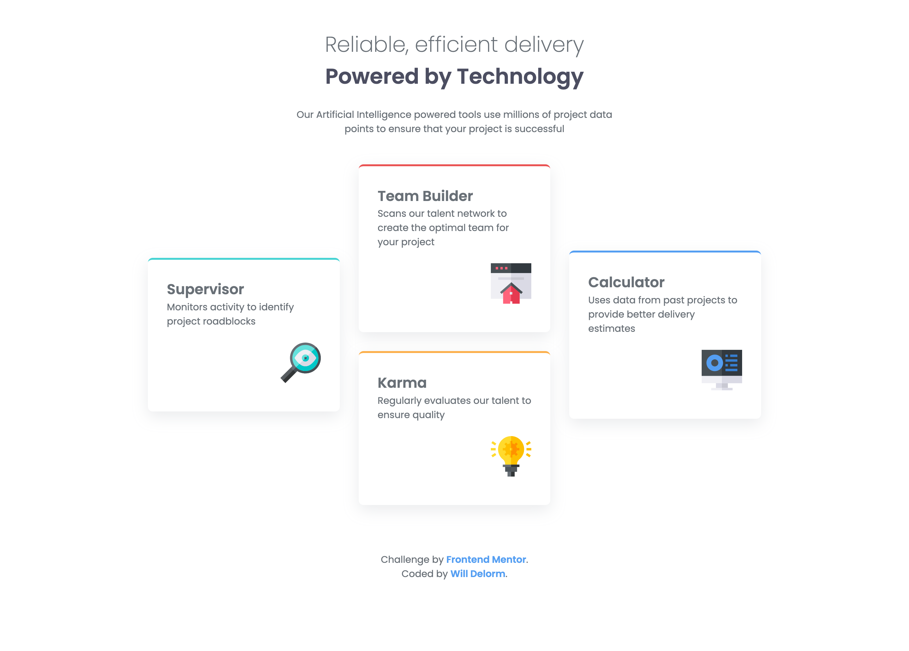

# Frontend Mentor - Four card feature section solution

This is a solution to the [Four card feature section challenge on Frontend Mentor](https://www.frontendmentor.io/challenges/four-card-feature-section-weK1eFYK).

## Table of contents

- [Overview](#overview)
  - [The challenge](#the-challenge)
  - [Screenshot](#screenshot)
  - [Links](#links)
- [My process](#my-process)
  - [Built with](#built-with)
  - [What I learned](#what-i-learned)
  - [Continued development](#continued-development)
- [Author](#author)
- [Acknowledgments](#acknowledgments)

## Overview

### The challenge

Users should be able to:

- View the optimal layout for the site depending on their device's screen size

### Screenshot

### Links

- Solution URL: [Github](https://github.com/willdelorm/four-card-feature-section)
- Live Site URL: [Github Pages](https://willdelorm.github.io/four-card-feature-section)

## My process

### Built with

- Semantic HTML5 markup
- Flexbox
- CSS Grid
- Mobile-first workflow
- [Sass](https://sass-lang.com/) - CSS preprocessor

### What I learned

The `&` parent selector was very handy to set custom border colors for each card on this project. I was able to group them all under one selector, then add on to it with a color class.

### Continued development

I look forward to writing with Sass in my future projects.

## Author

- Website - [Will Delorm](https://willdelorm.com)
- Frontend Mentor - [@willdelorm](https://www.frontendmentor.io/profile/willdelorm)
